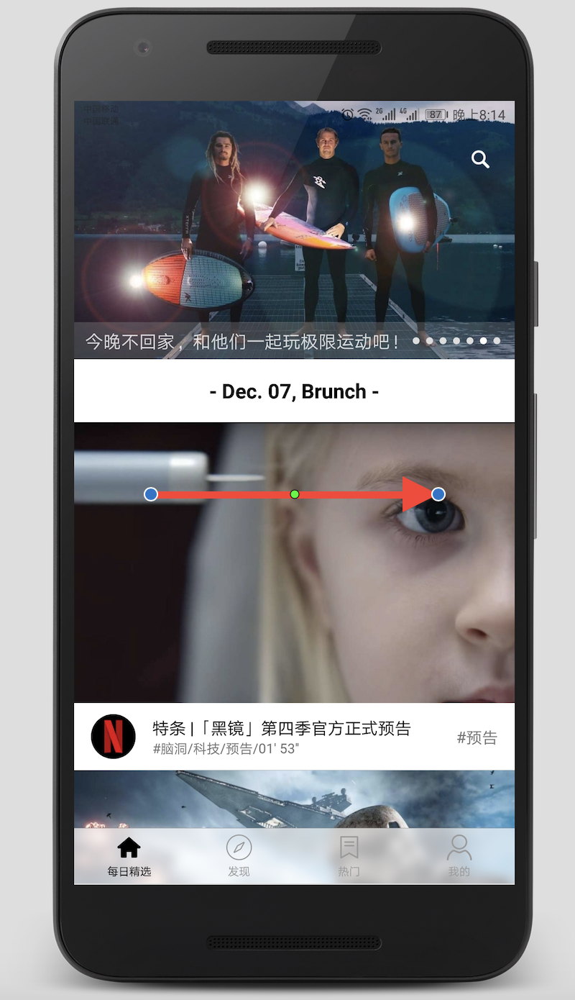

# Kotlin-Video

《Kotlin-Video》 是仿着“开眼Eyepetizer”之前版本并加上自己的想法，开发的一款的短视频小应用，每日为你推荐精选视频，让你大开眼界。本项目采用 Kotlin 语言编写，结合 MVP+RxJava2+Retrofit2+Glide等的架构设计，学习 Kotlin 利用空余时间开发的一款小项目，代码结构清晰有详细注释，

## 前言

前段时间学习了 Kotlin 的一些语法，然后就写了这个项目熟悉一下 Android的官方语言，总体下来，感觉比较爽，相比 Java 而言源代码行数有所减少、方法数也有所减少。

Kotlin 团队为 Android 开发提供了一套超越标准语言功能的工具：

- [Kotlin Android 扩展](https://www.kotlincn.net/docs/tutorials/android-plugin.html)是一个编译器扩展， 可以让你摆脱代码中的 `findViewById()` 调用，并将其替换为合成的编译器生成的属性。
- [Anko](http://github.com/kotlin/anko) 是一个提供围绕 Android API 的 Kotlin 友好的包装器的库 ，以及一个可以用 Kotlin 代码替换布局 .xml 文件的 DSL。

## 项目截图

- 截图

## 技术要点
主要使用的第三方开源框架有：

 - [RxJava](https://github.com/ReactiveX/RxJava)
 - [RxAndroid](https://github.com/ReactiveX/RxAndroid)
 - [Retrofit](https://github.com/square/retrofit)
 - [Glide](https://github.com/bumptech/glide)
 - [Logger](https://github.com/orhanobut/logger)
 - [FlycoTabLayout](https://github.com/H07000223/FlycoTabLayout)
 - [Flexbox-layout](https://github.com/google/flexbox-layout)
 - [RealtimeBlurView](https://github.com/mmin18/RealtimeBlurView)
 - [SmartRefreshLayout](https://github.com/scwang90/SmartRefreshLayout)
 - [BGABanner-Android](https://github.com/bingoogolapple/BGABanner-Android)
 - [GSYVideoPlayer](https://github.com/CarGuo/GSYVideoPlayer)

模块说明：

 - **每日精选：** 首页采用下拉刷新+RecyclerView 实现，Banner展示每日精选推荐的视频，监听 RecyclerView 的滑动事件，实现 TitleBar 的隐藏显示功能，底部菜单采用高斯模糊的半透明效果，使整个 APP 风格更加清爽。
 - **发现：** 包括关注和分类模块，关注是推荐的作者上传的视频集，分类包括时尚、运动、创意、广告、音乐、旅行、生活、记录、开胃、游戏、萌宠、动画、综艺、搞笑等可自由选择想查看的类型视频。
 - **热门：** 热门排行榜包括周排行、月排行、总排行的视频列表。
 - **搜索：** 根据关键字搜索榜你找到感兴趣的视频。
 - **我的：** 个人主页的相关介绍。
 - **观看记录：** 查看之前看过的视频，按时间进行排序。

